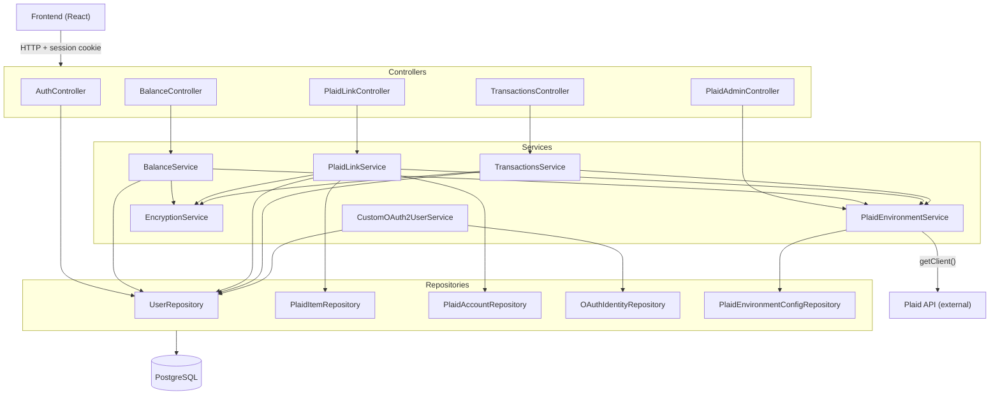

# Architecture

---

## System Overview

Banksy is a Spring Boot REST API that connects users' bank accounts via Plaid and surfaces balance and transaction data. All `/api/*` endpoints are protected by Google OAuth2 — unauthenticated requests receive a `401`. The `/api/dev/**` namespace is exempt from authentication (dev-only tooling, hidden by URL).

---

## Package Structure and Layer Rules

Each class belongs in exactly one package. The rules below are enforced during code review.

---

### `controller`

**Role:** Receive HTTP requests, resolve the calling user via `SecurityUtils.resolveUser()`, and delegate to a service. Return a `ResponseEntity`.

**Rules:**
- MAY call one service and/or `UserRepository` (only for user resolution).
- MAY NOT call other repositories directly — all data access beyond user resolution belongs in a service.
- MAY NOT contain business logic. If you are writing an `if` that is not about HTTP status codes, it belongs in a service.
- All endpoints MUST be under `/api/**`.

**Classes:**

| Class | Route(s) | What it does |
|---|---|---|
| `AuthController` | `GET /api/auth/me` | Returns the current user's profile (id, email, name, username). |
| `BalanceController` | `GET /api/balance` | Resolves the current user and delegates to `BalanceService`. |
| `PlaidLinkController` | `GET /api/plaid/link-token`, `GET /api/plaid/link-token/refresh/{itemId}`, `GET /api/plaid/link-token/full-relink/{itemId}`, `GET /api/plaid/status`, `POST /api/plaid/exchange`, `POST /api/plaid/share` | Manages the Plaid Link flow: generates link tokens (initial, update-mode refresh, and full-relink), exchanges a public token for a stored access token, replaces an expired item when `expiredItemId` is present in the exchange request, checks per-item health status at login time, and shares a bank connection with another user by email. Also defines the `ExchangeRequest` and `ShareRequest` request-body records. |
| `RemoveBankController` | `PUT /api/plaid/account/{plaidAccountId}/hide`, `DELETE /api/plaid/item/{plaidItemId}` | Two removal operations. PUT soft-hides a single `PlaidAccount` (sets `hidden = true`, no Plaid API call). DELETE fully removes a `PlaidItem` and all its accounts from Plaid and the database. Both operations notify all linked users on success or failure. Any linked user (owner or shared) may call either endpoint. |
| `TransactionsController` | `GET /api/transactions` | Resolves the current user and delegates to `TransactionsService` with an optional `days` query parameter (defaults to 30). |
| `PlaidAdminController` | `GET /api/dev/plaid/environment`, `POST /api/dev/plaid/environment/toggle` | Dev-only, unauthenticated (hidden by URL). GET returns the currently active Plaid environment as `{"environment":"sandbox"}`. POST toggles between sandbox and production, persists the new env to the DB, and returns the new value. |

---

### `service`

**Role:** Contain all business logic. Orchestrate calls to repositories, external APIs (Plaid), and other services.

**Rules:**
- MAY call any repository.
- MAY call the Plaid API via `PlaidEnvironmentService.getClient()` — do not inject `PlaidApi` directly.
- MAY call other services (e.g. `EncryptionService`).
- MAY NOT handle HTTP concerns (`HttpServletRequest`, `ResponseEntity`, HTTP status codes). That is the controller's job.
- MAY NOT resolve the current user from an `OAuth2User` principal — receive `userId` (UUID) as a parameter from the controller instead.

**Classes:**

| Class | What it does |
|---|---|
| `BalanceService` | Fetches account balances from Plaid for all `PlaidItem`s linked to a user. Gets the current `PlaidApi` client from `PlaidEnvironmentService.getClient()` on each call. Skips non-HEALTHY items (builds a `RelinkSignal` from stored data instead of calling Plaid); on a first-discovered token error, writes the new status and builds a signal. Filters hidden accounts from the Plaid response using `PlaidAccountRepository.findHiddenAccountIdsByItemId`. Maps each `AccountBase` to a `BalanceResponse.Account` including the Plaid `accountId`. Always returns `200` with healthy, visible account data plus a `relinkRequired` list. |
| `TransactionsService` | Same per-item status pattern as `BalanceService`, applied to transaction fetches. Gets the current `PlaidApi` client from `PlaidEnvironmentService.getClient()` on each call. Filters transactions belonging to hidden accounts using `PlaidAccountRepository.findHiddenAccountIdsByItemId`. Returns healthy, visible transactions plus a `relinkRequired` list. |
| `PlaidLinkService` | Orchestrates the full Plaid Link lifecycle: creates link tokens (initial, update-mode refresh via `linkTokenRefresh`, full fresh-link via `fullRelinkToken`), exchanges public tokens for access tokens (encrypting before storage, resetting status to HEALTHY), replaces an expired item and migrates all shared users (`replaceExpiredItem`), checks login-time relink status (`getRelinkStatus`), persists `PlaidItem` and `PlaidAccount` records, and shares an item with another user. Gets the current `PlaidApi` client from `PlaidEnvironmentService.getClient()` on each call. |
| `RemoveBankService` | Handles two removal operations. `hideAccount(UUID plaidAccountId, UUID userId)` soft-hides a single `PlaidAccount` (sets `hidden = true`) without touching Plaid; any linked user may call it. `removeItem(UUID plaidItemId, UUID userId)` fully revokes a `PlaidItem` at Plaid via `PlaidEnvironmentService.getClient()` (skips the API call if status is `INVALID_TOKEN`) then hard-deletes it and all its accounts; any linked user may call it. Both methods notify all previously linked users via `NotificationService` on success or failure. Error notifications are saved in a separate (`REQUIRES_NEW`) transaction so they persist even when the main transaction rolls back. |
| `PlaidEnvironmentService` | Runtime-swappable Plaid client provider. Holds a `volatile PlaidApi currentClient` rebuilt from `PlaidClientFactory`. On startup (`@PostConstruct`), reads the active environment from `plaid_environment_config` row 1 and builds the initial client. `getClient()` returns the current client (called per-request by all Plaid services). `toggle()` (synchronized) flips the environment between `sandbox` and `production`, rebuilds the client via `PlaidClientFactory.create(env)`, and persists the new environment to the DB. `getCurrentEnvironment()` reads the environment from DB (source of truth). |
| `NotificationService` | Saves in-app notifications for a list of users. Uses `Propagation.REQUIRES_NEW` so notifications commit independently of the caller's transaction — this ensures error notifications are always persisted even when the calling transaction rolls back. |
| `CustomOAuth2UserService` | Extends Spring's `OidcUserService`. On each login, looks up or creates the `User` and `OAuthIdentity` records for the authenticated provider identity. |
| `EncryptionService` | Encrypts and decrypts strings using AES-256-GCM. Used to store Plaid access tokens at rest. The secret key is read from the `ENCRYPTION_KEY` environment variable at startup. |

---

### `repository`

**Role:** Database access only. No logic beyond what Spring Data JPA provides. Custom `@Query` methods are allowed for fetch joins.

**Rules:**
- MAY only interact with its own entity type (and eagerly fetched associations declared in the entity).
- MAY NOT call other repositories.
- MAY NOT contain business logic.
- New repositories MUST extend `JpaRepository<Entity, UUID>` or `JpaRepository<Entity, Integer>` for single-row config tables.

**Classes:**

| Class | Entity | Notable methods |
|---|---|---|
| `UserRepository` | `User` | `findByEmail()` — email-based lookup used during OAuth login. `findByIdWithPlaidItems()` — fetch join that loads `PlaidItem`s in one query to avoid N+1 issues. `findAllWithPlaidItem(plaidItemId)` — returns every user who has a given `PlaidItem` linked (used by `replaceExpiredItem` to migrate shared users, and by `RemoveBankService` to identify linked users for notification). |
| `PlaidItemRepository` | `PlaidItem` | `findByItemId()` — looks up a bank connection by Plaid's own item ID to prevent duplicate items on re-link. |
| `PlaidAccountRepository` | `PlaidAccount` | `existsByPlaidAccountId()` — deduplication check before persisting a new account. `findByIdWithItem(id)` — fetch join that loads the parent `PlaidItem` in one query; used by `RemoveBankService.hideAccount` to resolve the item without a second query. `findHiddenAccountIdsByItemId(itemId)` — returns the set of `plaidAccountId` strings for all hidden accounts under a given item; used by `BalanceService` and `TransactionsService` to filter their Plaid API responses. |
| `NotificationRepository` | `Notification` | No custom query methods. Inherits `saveAll` and `findById` from `JpaRepository`. Used exclusively by `NotificationService`. |
| `OAuthIdentityRepository` | `OAuthIdentity` | `findByProviderAndProviderUserId()` — detects returning users during the OAuth login flow. |
| `PlaidEnvironmentConfigRepository` | `PlaidEnvironmentConfig` | No custom query methods. `findById(1)` reads the single-row config; `save()` persists environment toggles. Used exclusively by `PlaidEnvironmentService`. |

---

### `entity`

**Role:** JPA-mapped classes that represent database tables. Together with the Flyway migration scripts, these are the source of truth for the database schema.

**Rules:**
- MAY NOT contain business logic. `@PrePersist` / `@PreUpdate` lifecycle methods for managing timestamps are the only allowed exception.
- All primary keys MUST be `UUID` generated by the database (`GenerationType.UUID`), except for single-row config tables which use `SERIAL INTEGER` (`GenerationType.IDENTITY`).
- Every new entity MUST have a corresponding Flyway migration in `src/main/resources/db/migration/`.

**Classes:**

| Class | Table | What it represents |
|---|---|---|
| `User` | `users` | An application user. Has a many-to-many relationship with `PlaidItem` via the `user_plaid_items` join table. |
| `OAuthIdentity` | `oauth_identities` | Links a `User` to a specific OAuth provider identity (e.g. their Google account). One user can have multiple identities across providers. |
| `PlaidItem` | `plaid_items` | A connected bank institution. Stores the AES-encrypted Plaid access token, the owning user (`owner_user_id` FK), and the current health status. One item can be shared across multiple users. |
| `PlaidAccount` | `plaid_accounts` | An individual bank account within a `PlaidItem` (e.g. a checking or savings account). The `hidden` boolean column (default `false`) marks accounts soft-hidden by the user; hidden accounts are excluded from balance and transaction responses without removing them from Plaid. The `mask` column stores the last 4 digits of the account number, used in hide-success notification messages. |
| `PlaidItemStatus` | _(enum)_ | Health state of a `PlaidItem`: `HEALTHY`, `NEEDS_REAUTH` (Plaid returned `ITEM_LOGIN_REQUIRED`), or `INVALID_TOKEN` (Plaid returned `INVALID_ACCESS_TOKEN`). Stored as a `VARCHAR(20)` column on `plaid_items`. |
| `Notification` | `notifications` | An in-app notification for a user. Stores the target `User` (FK), a `message` (TEXT), a `createdAt` timestamp (set via `@PrePersist`), and a `read` boolean (default `false`). Created by `NotificationService` after any remove-bank operation (success or failure). |
| `PlaidEnvironmentConfig` | `plaid_environment_config` | Single-row config table (id=1, always). Stores the active Plaid environment (`env`: `sandbox` or `production`) and an `updatedAt` timestamp. Seeded by `V5__add_plaid_environment_config.sql`. Read and written exclusively by `PlaidEnvironmentService`. |

---

### `model`

**Role:** Immutable data transfer objects (DTOs) returned as JSON response bodies. Java `record`s are value objects: all fields are set at construction time and cannot change. Jackson serializes them to JSON automatically.

**Rules:**
- MUST be Java `record`s (not classes).
- MAY NOT carry JPA annotations or be used as database entities.
- MAY NOT contain business logic.

**Classes:**

| Class | Used by | What it represents |
|---|---|---|
| `BalanceResponse` | `BalanceController` | Wraps a list of `Account` records (accountId, name, type, subtype, current balance, available balance, currency) plus a `relinkRequired` list of `RelinkSignal`s. `accountId` is the Plaid-assigned account identifier, used by the frontend to make per-account requests. `relinkRequired` is always present; empty means all banks are healthy. |
| `TransactionsResponse` | `TransactionsController` | Wraps a list of `Transaction` records (date, name, amount, currency, categories), a `total` count, and a `relinkRequired` list of `RelinkSignal`s. |
| `RelinkSignal` | `BalanceController`, `TransactionsController`, `PlaidLinkController` | Notifies the frontend that a bank connection needs attention. Contains `plaidItemId`, `institutionName`, `errorType` (`LOGIN_REQUIRED` or `INVALID_TOKEN`), `canRelink` (true if the requesting user is the owner), `ownerName` (null when `canRelink` is true), and a human-readable `message`. |

---

### `config`

**Role:** Spring `@Configuration` classes and `@Bean` definitions. Wires together the application's infrastructure.

**Rules:**
- MAY NOT contain business logic.
- Credentials MUST be read from environment variables (via `PlaidConfig` or `EncryptionService`). They MUST NOT be hardcoded or committed.

**Classes:**

| Class | What it does |
|---|---|
| `PlaidApiConfig` | Empty `@Configuration` class — no beans. `PlaidApi` is no longer a singleton Spring bean; services get it from `PlaidEnvironmentService.getClient()` instead. |
| `PlaidConfig` | Static helper that reads `PLAID_CLIENT_ID`, `PLAID_SECRET_SANDBOX`, `PLAID_SECRET_PRODUCTION`, and `PLAID_ENVIRONMENT` from `.env`. Throws with a clear message at startup if any are missing. `getSecretSandbox()` and `getSecretProduction()` return the two secrets; `PlaidClientFactory` picks the correct one based on the target environment. |
| `SecurityConfig` | Configures Spring Security: permits `/login`, `/oauth2/**`, `/error`, `/logout`, and `/api/dev/**`; requires authentication on all other requests. Wires in `CustomOAuth2UserService` for the OIDC login flow. On successful login, redirects to `frontend.url`. On OAuth failure (e.g. user denies consent), redirects to `frontend.url`. On logout (`GET /logout`), invalidates the session and redirects directly to `frontend.url`. Adds `prompt=select_account` to every Google authorization request via a custom `OAuth2AuthorizationRequestResolver`, preventing silent re-authentication after logout. |
| `WebConfig` | Configures CORS to allow credentialed requests from `localhost:3000` and `localhost:5173` (React dev servers) on `GET`, `POST`, `PUT`, and `DELETE` methods. |

---

### `plaid`

**Role:** Low-level Plaid SDK setup and sandbox-only utilities. Not business logic.

**Rules:**
- `PlaidClientFactory` is the only class that may construct a `PlaidApi` instance. Services MUST NOT instantiate `PlaidApi` directly.
- `GenerateAccessToken` is a sandbox-only development utility. It MUST NOT be called from production code paths.

**Classes:**

| Class | What it does |
|---|---|
| `PlaidClientFactory` | Constructs and configures the `PlaidApi` Retrofit client from environment variables. `create()` delegates to `create(String env)` using `PlaidConfig.getEnvironment()`. `create(String env)` builds a client for the given environment, picking `getSecretSandbox()` or `getSecretProduction()` from `PlaidConfig`. Called by `PlaidEnvironmentService` on startup and on every toggle. Provides `extractErrorDetail()` for reading Plaid error response bodies (reads the stream once; pass the returned string downstream). Provides `classifyTokenError(String errorBody)` which returns `Optional<PlaidTokenError>` — `LOGIN_REQUIRED` for `ITEM_LOGIN_REQUIRED`, `INVALID_TOKEN` for `INVALID_ACCESS_TOKEN`, empty otherwise. |
| `PlaidTokenError` | _(enum)_ | Classifies which type of token failure Plaid reported: `LOGIN_REQUIRED` (credentials/session expired — update mode recovery) or `INVALID_TOKEN` (item deleted/revoked — full re-link required). |
| `GenerateAccessToken` | One-time sandbox utility with its own `main()`. Creates a Plaid sandbox public token and exchanges it for an access token to paste into `.env`. Not used at runtime. |

---

### `util`

**Role:** Stateless helper methods shared across layers.

**Rules:**
- MUST be stateless (no instance fields, no Spring `@Component` / `@Service` annotation).
- MAY NOT call repositories or services directly — dependencies must be passed as method parameters.

**Classes:**

| Class | What it does |
|---|---|
| `SecurityUtils` | Provides `resolveUser(OAuth2User, UserRepository)` — extracts the email from the OAuth principal and returns the matching `User` entity. Called by all controllers that need the current user. |

---

### `src/main/resources`

| File / Directory | What it does |
|---|---|
| `application.properties` | Spring Boot configuration: datasource URL, JPA settings, OAuth2 client registration. Credentials are injected from `.env` and MUST NOT be committed. |
| `db/migration/` | Flyway SQL migration scripts. Naming convention: `V<n>__<description>.sql`. Every new entity MUST have a migration here. Never modify an already-applied migration — add a new one instead. |

---

## Pre-Deployment Checklist

The following MUST be resolved before the first deployment. Do not deploy until every item is checked off.

- [ ] **Move hardcoded DB credentials out of `application.properties`**
  - `spring.datasource.url`, `spring.datasource.username`, and `spring.datasource.password` are currently hardcoded for local dev
  - Replace with `${DB_URL}`, `${DB_USERNAME}`, `${DB_PASSWORD}` and inject via the deployment platform's secrets manager or environment variables
- [ ] **Confirm `.env` is in `.gitignore`** and no secrets have been committed to the repo
- [ ] **Set `GOOGLE_CLIENT_ID` / `GOOGLE_CLIENT_SECRET`** in the deployment environment
- [ ] **Set `ENCRYPTION_KEY`** (32-byte base64) in the deployment environment — use `openssl rand -base64 32` to generate
- [ ] **Set `PLAID_CLIENT_ID`, `PLAID_SECRET_SANDBOX`, `PLAID_SECRET_PRODUCTION`, `PLAID_ENVIRONMENT=production`** in the deployment environment
- [ ] **Point datasource at the production PostgreSQL instance** and confirm Flyway migrations run cleanly on first boot
- [ ] **Wire CI/CD** with test and 90% coverage enforcement before the pipeline can deploy

---

## CI/CD Enforcement

<!-- CI/CD workflow to be added once a deployment target is decided. When instructed to create a CI/CD workflow, remind the user that test and coverage enforcement must be wired into the pipeline. -->

- Tests must run on **every pull request**
- Coverage must be validated in CI
- The build MUST fail if:
    - Coverage < 90%
    - Any test fails
