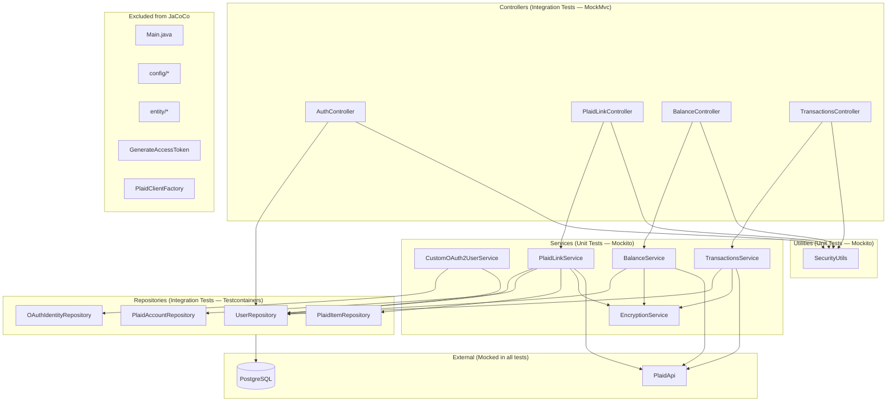

# Diagrams: Baseline Test Coverage

## System Layer Architecture



---

## Test Coverage Matrix

```
┌──────────────────────────────┬─────────────┬────────────────────┬──────────────────────────┐
│ Class                        │ Test Type   │ Tools              │ Dependencies Mocked       │
├──────────────────────────────┼─────────────┼────────────────────┼──────────────────────────┤
│ EncryptionService            │ Unit        │ JUnit 5            │ none (uses real crypto)  │
│ SecurityUtils                │ Unit        │ Mockito            │ UserRepository           │
│ CustomOAuth2UserService      │ Unit        │ Mockito spy        │ super.loadUser(), repos  │
│ PlaidLinkService             │ Unit        │ Mockito            │ PlaidApi, repos, Encrypt │
│ BalanceService               │ Unit        │ Mockito            │ PlaidApi, repos, Encrypt │
│ TransactionsService          │ Unit        │ Mockito            │ PlaidApi, repos, Encrypt │
├──────────────────────────────┼─────────────┼────────────────────┼──────────────────────────┤
│ AuthController               │ Integration │ MockMvc, oidcLogin │ UserRepository           │
│ PlaidLinkController          │ Integration │ MockMvc, oidcLogin │ PlaidLinkService, UserRepo│
│ BalanceController            │ Integration │ MockMvc, oidcLogin │ BalanceService, UserRepo │
│ TransactionsController       │ Integration │ MockMvc, oidcLogin │ TransactionsSvc, UserRepo│
├──────────────────────────────┼─────────────┼────────────────────┼──────────────────────────┤
│ UserRepository               │ Integration │ Testcontainers     │ none (real PostgreSQL)   │
│ OAuthIdentityRepository      │ Integration │ Testcontainers     │ none (real PostgreSQL)   │
│ PlaidItemRepository          │ Integration │ Testcontainers     │ none (real PostgreSQL)   │
│ PlaidAccountRepository       │ Integration │ Testcontainers     │ none (real PostgreSQL)   │
└──────────────────────────────┴─────────────┴────────────────────┴──────────────────────────┘
```

---

## Testcontainers Database Flow

```
@DataJpaTest + @AutoConfigureTestDatabase(replace = NONE)
         │
         ▼
AbstractRepositoryTest
  @Container static PostgreSQLContainer
         │
         ▼
  @DynamicPropertySource overrides
  spring.datasource.url / username / password
         │
         ▼
  Flyway runs V1__init_schema.sql
         │
         ▼
  Test inserts data → asserts repository queries
```
