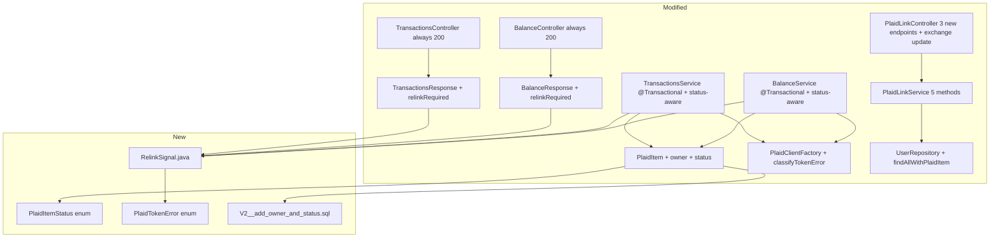

# Diagrams: Revoked Token Recovery

---

## Login-Time Status Check (Sequence)

```
Frontend            PlaidLinkController   PlaidLinkService    PlaidItem DB
   │                        │                    │                  │
   │  [user logs in]        │                    │                  │
   │  GET /api/plaid/status │                    │                  │
   │───────────────────────>│                    │                  │
   │                        │  getRelinkStatus   │                  │
   │                        │───────────────────>│                  │
   │                        │                    │  query items     │
   │                        │                    │  where status != │
   │                        │                    │  HEALTHY         │
   │                        │                    │─────────────────>│
   │                        │                    │  [items]         │
   │                        │                    │<─────────────────│
   │                        │  (no Plaid API calls — stored status only)
   │  200 { relinkRequired: [{...}, ...] }        │                  │
   │<───────────────────────│                    │                  │
   │  (show non-blocking relink prompt or nothing if list is empty)
```

---

## First Discovery: Token Error on Balance Request (Sequence)

```
Frontend     BalanceController    BalanceService     PlaidApi     PlaidItem DB
   │                │                   │               │              │
   │  GET /api/balance                  │               │              │
   │───────────────>│                   │               │              │
   │                │  getBalance(uid)  │               │              │
   │                │──────────────────>│               │              │
   │                │                   │  item.status == HEALTHY      │
   │                │                   │  → make Plaid call           │
   │                │                   │──────────────>│              │
   │                │                   │  ITEM_LOGIN_REQUIRED         │
   │                │                   │<──────────────│              │
   │                │                   │  write status = NEEDS_REAUTH │
   │                │                   │─────────────────────────────>│
   │                │                   │  build RelinkSignal          │
   │                │                   │  skip item, continue         │
   │                │                   │               │              │
   │                │                   │  (other items succeed normally)
   │                │                   │               │              │
   │  200 { accounts:[healthy data], relinkRequired:[{errorType:LOGIN_REQUIRED,...}] }
   │<───────────────│                   │               │              │
   │  (non-blocking: user sees healthy banks + notification)
```

---

## Subsequent Request: Status Already Stored (Sequence)

```
Frontend     BalanceController    BalanceService     PlaidItem DB
   │                │                   │                  │
   │  GET /api/balance                  │                  │
   │───────────────>│──────────────────>│                  │
   │                │                   │  item.status == NEEDS_REAUTH
   │                │                   │  → NO Plaid call │
   │                │                   │  build RelinkSignal from stored data
   │                │                   │  skip item       │
   │                │                   │  (other items: Plaid calls as normal)
   │  200 { accounts:[healthy data], relinkRequired:[{...}] }
   │<───────────────│
```

---

## LOGIN_REQUIRED Recovery Flow (Sequence)

```
Frontend       PlaidLinkController   PlaidLinkService    PlaidApi
   │                   │                    │               │
   │  [user acts on relink prompt]          │               │
   │  GET /api/plaid/link-token/refresh/{itemId}            │
   │──────────────────>│                    │               │
   │                   │  linkTokenRefresh  │               │
   │                   │───────────────────>│               │
   │                   │                    │  linkTokenCreate(accessToken=stored)
   │                   │                    │──────────────>│
   │  200 { link_token }                    │<──────────────│
   │<──────────────────│                    │               │
   │  [User completes Plaid Link — update mode]             │
   │  POST /api/plaid/exchange { publicToken, institutionId, institutionName }
   │──────────────────>│                    │               │
   │                   │  exchangeAndStore  │               │
   │                   │───────────────────>│               │
   │                   │                    │  itemPublicTokenExchange
   │                   │                    │──────────────>│
   │                   │                    │  compare new token vs stored
   │                   │                    │  update token if different
   │                   │                    │  reset status = HEALTHY
   │  200 { status:"ok", message:"Plaid authentication successful" }
   │<──────────────────│                    │               │
   │  (GET /api/balance retry → 200, all banks healthy)
```

---

## INVALID_TOKEN Recovery Flow — Owner (Sequence)

```
Frontend       PlaidLinkController   PlaidLinkService    PlaidApi     UserRepository
   │                   │                    │               │               │
   │  GET /api/plaid/link-token/full-relink/{itemId}        │               │
   │──────────────────>│                    │               │               │
   │                   │  fullRelinkToken   │               │               │
   │                   │───────────────────>│               │               │
   │                   │                    │  linkTokenCreate (no accessToken)
   │                   │                    │──────────────>│               │
   │  200 { link_token }                    │<──────────────│               │
   │<──────────────────│                    │               │               │
   │  [User completes Plaid Link — full fresh flow]         │               │
   │  POST /api/plaid/exchange { publicToken, institutionId, institutionName, expiredItemId }
   │──────────────────>│                    │               │               │
   │                   │  exchangeAndStore → creates new PlaidItem (status=HEALTHY)
   │                   │  replaceExpiredItem(oldId, newId)  │               │
   │                   │───────────────────>│               │               │
   │                   │                    │  findAllWithPlaidItem(oldId)   │
   │                   │                    │───────────────────────────────>│
   │                   │                    │  [User A, User B, ...]         │
   │                   │                    │  migrate all users → new item  │
   │                   │                    │  delete old item               │
   │  200 { status:"ok", message:"Plaid authentication successful" }
   │<──────────────────│
```

---

## INVALID_TOKEN — Non-Owner Shared User (Sequence)

```
Frontend (User B)   BalanceController   BalanceService
       │                    │                 │
       │  GET /api/balance  │                 │
       │───────────────────>│────────────────>│
       │                    │  Bank A: status = INVALID_TOKEN
       │                    │  owner = User A (not current user)
       │                    │  build RelinkSignal:
       │                    │    canRelink: false
       │                    │    ownerName: "Alice Smith"
       │                    │    message: "Bank needs to be reauthenticated,
       │                    │             contact Alice Smith and have them
       │                    │             follow the prompts to re-authenticate this bank"
       │                    │  Bank B: status = HEALTHY → Plaid call → data returned
       │  200 { accounts:[Bank B data], relinkRequired:[{canRelink:false, ownerName:"Alice Smith",...}] }
       │<───────────────────│
       │  (User B sees Bank B data + info message — no relink action required from them)
```

---

## `exchangeAndStore` Token Comparison and Status Reset

```
exchangeAndStore(publicToken, institutionId, institutionName, userId)
        │
        ▼
  exchange publicToken → new accessToken (from Plaid)
        │
        ▼
  findByItemId(itemId)
        │
   ┌────┴──────────────────────┐
   │ NOT found                 │ FOUND
   │ → create new PlaidItem    │       │
   │ → set owner = user        │       ▼
   │ → set status = HEALTHY    │  decrypt storedToken
   │ → save accounts           │       │
   │ → add to user's list      │  storedToken == newToken?
   └───────────────────────────┘  │                  │
                                 YES                 NO
                                  │                  │
                             skip token         encrypt + save
                             re-encrypt         new token
                                  │                  │
                                  └────────┬─────────┘
                                           │
                                  set status = HEALTHY
                                  save item
                                  return item
```

---

## `replaceExpiredItem` Data Migration

```
replaceExpiredItem(oldItemId, newItemId)   [@Transactional]
        │
        ▼
  load oldItem, newItem from DB
        │
        ▼
  userRepository.findAllWithPlaidItem(oldItemId) → [User A, User B, ...]
        │
        ▼
  for each user (within transaction):
    1. findByIdWithPlaidItems(user.id)
    2. plaidItems.remove(oldItem)
    3. plaidItems.add(newItem)
        │
        ▼
  plaidItemRepository.delete(oldItem)
  DB cascades:
    → plaid_accounts rows deleted
    → user_plaid_items rows for oldItem deleted
        │
        ▼
  All users now reference newItem — no gap in access
```

---

## Per-Item Status Decision in BalanceService / TransactionsService

```
for each PlaidItem in user.getPlaidItems():
        │
        ▼
  item.status != HEALTHY?
        │
   ┌────┴───────────────────────┐
   │ YES                        │ NO (HEALTHY)
   │ build RelinkSignal         │       │
   │ from stored data           │       ▼
   │ no Plaid call              │  make Plaid API call
   │ add to relinkRequired      │       │
   └────────────────────────────┘  success?
                                    │           │
                                   YES          NO
                                    │           │
                               add data    classifyTokenError?
                               to result        │
                                           ┌────┴────────────┐
                                           │ token error     │ other error
                                           │ write status    │ throw
                                           │ build signal    │ RuntimeException
                                           │ skip item       │
                                           └─────────────────┘

return 200 { accounts/transactions: [...healthy...], relinkRequired: [...] }
```

---

## Class-Level Change Map


